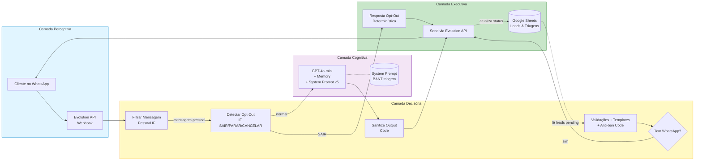
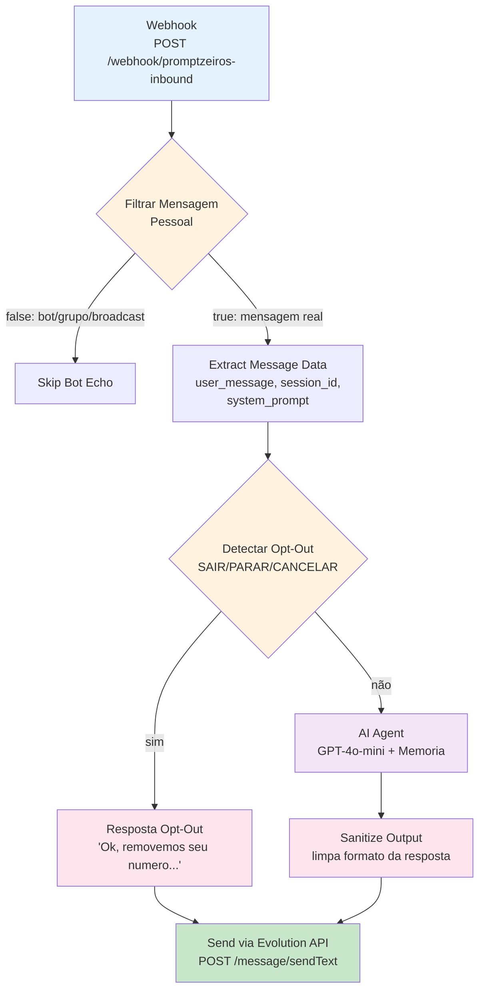
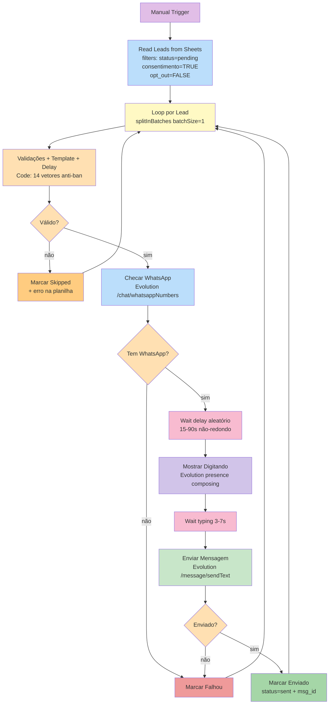
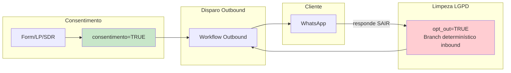
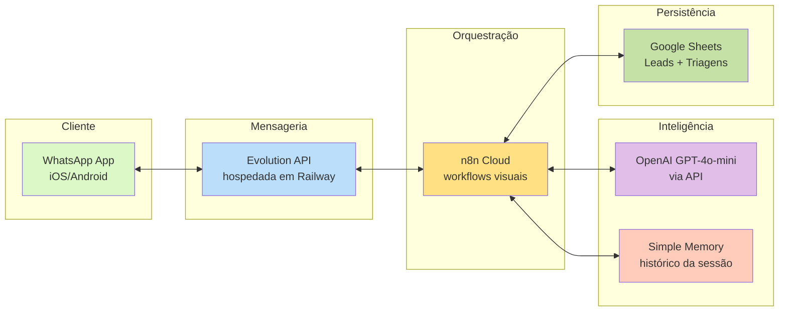

# Diagrama do Ecossistema Promptzeiros

> Renderiza no GitHub, GitLab, VSCode, Notion ou qualquer viewer com suporte a Mermaid

---

## Visão geral — 4 Camadas do Agente (Murta 2023)

---

## Workflow 1 — Inbound (Promptzeiros AI Agent)

**11 nós** · webhook path: `/webhook/promptzeiros-inbound`

---

## Workflow 2 — Outbound (Promptzeiros Outbound Disparo)

**15 nós** · dispara manualmente pelo botão "Execute Workflow" do n8n

---

## Diagrama de dados (LGPD)

---

## Stack técnica

